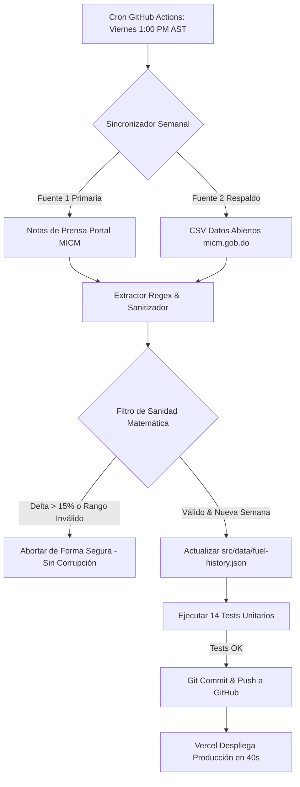

# subiólagasolina 🇩🇴

[](LICENSE)
[](https://nextjs.org/)
[](https://www.typescriptlang.org/)
[]()
[](https://subiolagasolina.com)

> **¿Subió la gasolina esta semana en República Dominicana?**  
> Terminal financiero ultraligero, de acceso libre y sin anuncios para consultar en tiempo real el veredicto oficial de precios de combustibles en RD, variaciones semanales, benchmarks internacionales (WTI), histórico desde 2020 y APIs públicas abiertas.

🌐 **Sitio Web Oficial:** [https://subiolagasolina.com](https://subiolagasolina.com)

---

## ⚡ Filosofía y Propósito

El proyecto nació como una herramienta cívica (**Civic Tech**) abierta y sin fricciones. En República Dominicana, las resoluciones semanales del Ministerio de Industria, Comercio y Mipymes (MICM) rigen bajo la Ley 112-00 y se anuncian cada viernes a la 1:00 PM AST.

En lugar de navegar sitios institucionales lentos o lidiar con PDFs confusos, **subiólagasolina** entrega:
1. **El veredicto en 1 segundo:** *"NO, SE MANTUVO"*, *"¡BAJÓ!"* o *"SÍ, SUBIÓ"*.
2. **Cero anuncios ni rastreadores intrusivos.**
3. **API pública gratuita y feeds abiertos** (RSS y JSON Feed) para que desarrolladores, periodistas y ciudadanos integren los datos en sus propias aplicaciones.
4. **Operación 100% automatizada a $0.00 de coste:** Diseñado con arquitectura *Git-as-a-Database* y Edge CDN Caching en Vercel.

---

## 🚀 Características Principales

- **Verdict Hero (Estilo Terminal Financiero):** Responde de un vistazo si los combustibles variaron esta semana, con detalles de subsidios extraordinarios del gobierno.
- **Precios de Consumo Masivo:**
  - Gasolina Premium
  - Gasolina Regular
  - Gasoil Óptimo
  - Gasoil Regular
  - Gas Licuado de Petróleo (GLP)
  - Gas Natural Vehicular (GNV)
- **Panel Industrial y Aviación:** Precios para Avtur, Kerosene, Fuel Oíl #6 y Fuel Oíl 1%S.
- **Contador Regresivo en Vivo (Ciclo Dominicano de 4 Fases):**
  1. *Conteo normal:* Cuenta regresiva hasta el viernes a las 12:59 PM AST.
  2. *Espera de divulgación:* Insignia de espera oficial en vivo si el ministerio retrasa el boletín pasadas la 1:00 PM.
  3. *Tarifas recién anunciadas:* Aviso de que entran en vigor a la medianoche (Sábado 00:00).
  4. *Reinicio automático:* El sábado a las 00:00 AST inicia automáticamente la cuenta hacia el próximo viernes.
- **Benchmark WTI Internacional:** Muestra la cotización del crudo Texas de referencia con porcentaje semanal.
- **Curva de Evolución Histórica:** Gráfica SVG interactiva con selectores de período (4 sem, 12 sem, 6 meses, Año actual, Histórico) y comparador por combustible.
- **Calculadora de Llenado de Tanque:** Calcula el costo real de llenar tu vehículo (Sedán, SUV, Pickup, Moto, Cilindro GLP) y la variación en pesos vs la semana anterior.
- **Historial Completo & Exportación:** Tabla con más de 357 semanas registradas y botón de descarga directa en **CSV**.
- **Compartir en 1 Clic:** Resúmenes preformateados para **WhatsApp** y **X (Twitter)**.
- **SEO & AEO (AI Engine Optimization):**
  - Schema.org (`SpecialAnnouncement`, `Dataset`, `FAQPage`).
  - `/sitemap.xml`, `/robots.txt`, `/manifest.webmanifest`.
  - `/llms.txt`: Endpoint optimizado para citación en ChatGPT, Perplexity, Claude y Apple Intelligence.

---

## 🔌 API Pública y Feeds Abiertos

El proyecto expone datos abiertos en múltiples formatos, libres para uso público bajo licencia **CC BY 4.0 (con atribución)**:

### 1. API REST JSON (`/api/prices`)
Caché de 24 horas en Edge CDN (`s-maxage=86400`) y soporte CORS completo.

```bash
# Resumen de la semana actual y veredicto
curl https://subiolagasolina.com/api/prices

# Consultar combustible específico con serie temporal
curl https://subiolagasolina.com/api/prices?fuel=gasolina-premium&weeks=12

# Incluir historial completo
curl https://subiolagasolina.com/api/prices?history=true&weeks=52
```

### 2. Feeds de Suscripción Semanal
- **RSS 2.0 XML:** [`https://subiolagasolina.com/feed.xml`](https://subiolagasolina.com/feed.xml)
- **JSON Feed 1.1:** [`https://subiolagasolina.com/feed.json`](https://subiolagasolina.com/feed.json)
- **AI Context Feed:** [`https://subiolagasolina.com/llms.txt`](https://subiolagasolina.com/llms.txt)

---

## ⚙️ Arquitectura de Ingesta Autónoma (Fail-Safe)

El portal oficial de Datos Abiertos del gobierno frecuentemente sufre retrasos de semanas en la carga de sus hojas CSV. Para resolver esto sin intervención humana, creamos un motor de ingesta dual en [`scripts/weekly-sync.mjs`](scripts/weekly-sync.mjs):



- **Workflow:** [`.github/workflows/weekly-sync.yml`](.github/workflows/weekly-sync.yml) corre cada 15 minutos entre la 1:00 PM y las 4:45 PM AST los viernes.
- **Salida temprana:** En cuanto detecta que la semana actual ya fue confirmada y guardada, finaliza en 2 segundos para ahorrar recursos.

---

## 🛠️ Stack Tecnológico

| Capa | Tecnología |
|---|---|
| **Framework** | Next.js 16.4 (App Router con Turbopack) |
| **Lenguaje** | TypeScript 5.9 (Strict mode) |
| **Estilos** | Tailwind CSS v4 + Variables CSS nativas |
| **Componentes e Iconos** | React 19, Lucide React |
| **Testing** | Node.js Test Runner nativo (`node:test`, `node:assert`, `tsx`) |
| **Automatización** | GitHub Actions (Ubuntu Runner) |
| **Hosting & Edge CDN** | Vercel Serverless & Edge Network |

---

## 💻 Desarrollo Local

```bash
# 1. Clonar el repositorio
git clone https://github.com/Amyels-CMD/subiolagasolina.git
cd subiolagasolina

# 2. Instalar dependencias
npm install

# 3. Correr la suite de pruebas unitarias
npm test

# 4. Validar linter y tipos
npm run lint

# 5. Iniciar servidor de desarrollo con Turbopack
npm run dev
```

Abre [http://localhost:3000](http://localhost:3000) en tu navegador.

---

## 🧪 Pruebas Automatizadas

El proyecto incluye 14 tests unitarios ejecutados en milisegundos con el runner nativo de Node.js:
```bash
npm test
```
Verifica:
- Matemáticas de cálculo de tanque y variaciones monetarias.
- Generación de feeds RSS 2.0 y JSON Feed 1.1 válidos.
- Cabeceras de Edge CDN caching y metadatos de `/api/prices`.
- Reglas temporales y transiciones del ciclo dominicano (AST UTC-4).

---

## 🤝 Contribuciones

Las contribuciones son bienvenidas. Si deseas corregir algún detalle, añadir una funcionalidad o mejorar los selectores de ingesta:
1. Haz un Fork del proyecto.
2. Crea una rama para tu feature (`git checkout -b feature/nueva-mejora`).
3. Asegúrate de que `npm test` y `npm run lint` pasen limpios.
4. Abre un Pull Request describiendo tus cambios.

---

## 📄 Licencia

Este proyecto es código abierto bajo la [Licencia MIT](LICENSE). Los datos oficiales pertenecen al Ministerio de Industria, Comercio y Mipymes (MICM) de la República Dominicana bajo políticas de Datos Abiertos gubernamentales.

